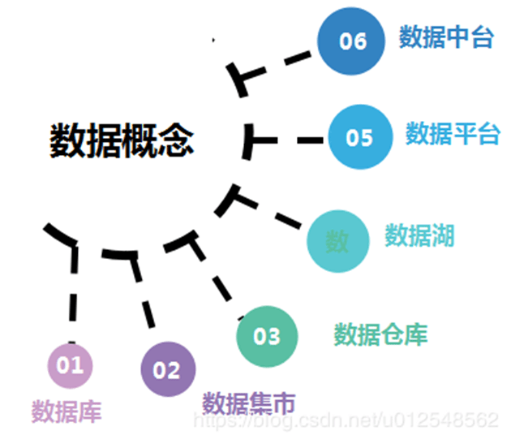
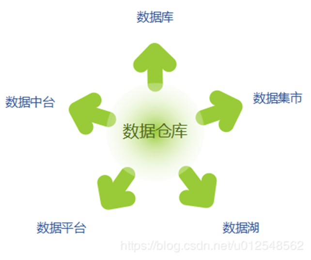
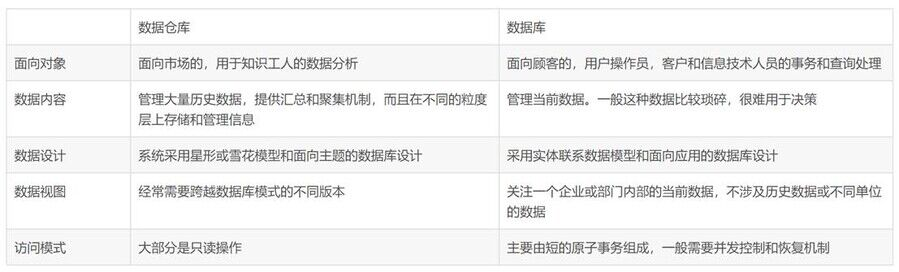
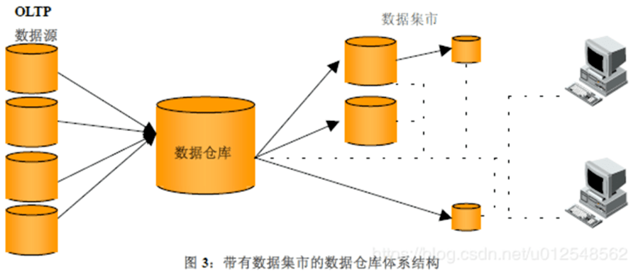
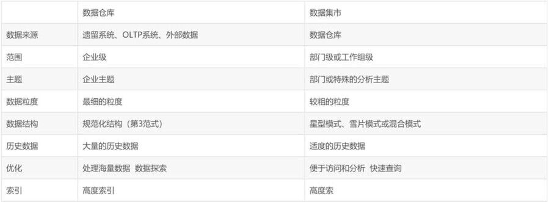
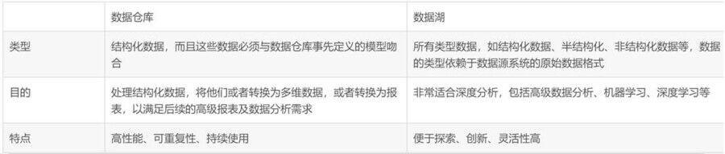
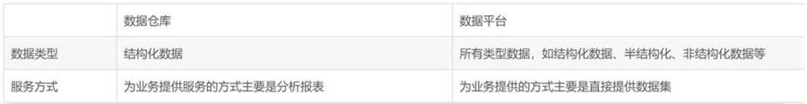
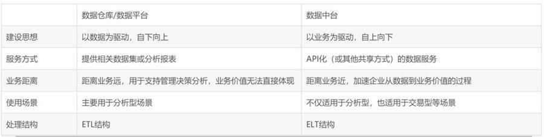

**关于数据中台、数据平台、数据仓库、数据湖等概念的对比解析**

 

**前言**

2010年左右，还是在上学的时候，学过一门课程叫《数据仓库与数据挖掘》，那还是属于传统数据的时代，我们会讨论什么是数据仓库？什么是数据集市？数据仓库和数据库有什么区别？等等，当我还在苦苦学习这些之时，大数据时代悄然到来，并迅速改变着各行各业。如今，十年风云际会，大数据早已成了行业绕不开的话题，这其中我们或多或少会接触到很多新兴的概念，例如数据湖、数据中台等，通过一些碎片化的学习，也是大概知道这些概念的意思，但要系统的说出这些概念之间的区别，深刻的了解其内涵，对我而言，恐怕还是困难的。所以，最近我系统的学习并总结了这些概念的含义和区别，写成本篇文章，分享给和我一样对此困惑并感兴趣的同学，希望理清这些概念的内涵和异同能对日后的工作有所帮助。

 

本篇文章将大体按照传统数据到大数据时代发展的时间轴介绍其中所涉及的数据概念，并以数据仓库为核心通过两两对比的方式总结其中的异同。本文属于综述性的概念科普文章，对其中所涉及到的方法论不做过多的阐述，感兴趣的同学可以查阅相关资料学习，后续，若时间允许，将陆续推出相关方法论系列介绍，同时欢迎有兴趣的同事和我一起完成。

 

**1** **概念介绍**

 

本文主要介绍如下几个数据概念：

**数据库**

数据库是“按照数据结构来组织、存储和管理数据的仓库”。是一个长期存储在计算机内的、有组织的、有共享的、统一管理的数据集合。

 

数据库是以一定方式储存在一起、能与多个用户共享、具有尽可能小的冗余度、与应用程序彼此独立的数据集合，可视为电子化的文件柜——存储电子文件的处所，用户可以对文件中的数据进行新增、查询、更新、删除等操作。——百度百科

 

**数据集市**

是企业级数据仓库的一个子集，他主要面向部门级业务，并且只面向某个特定的主题，按照多维的方式进行存储，包括定义维度需要计算的指标维度的层次等，生成面向决策分析需求的数据立方体。——wikipedia

 

**数据仓库**

是一个面向主题的、集成的、相对稳定的、反映历史变化的数据集合用于支持管理决策。其主要功能是将组织透过资讯系统之联机事务处理（OLTP）经年累月所积累的大量资料，透过数据仓库理论所特有的资料存储架构，作一有系统的分析整理，以利各种分析方法如联机分析处理（OLAP）、数据挖掘（Data Mining）之进行，并进而支持如决策支持系统（DSS）、主管资讯系统（EIS）之创建，帮助决策者能快速有效的自大量资料中，分析出有价值的资讯，以利决策拟定及快速回应外在环境变动，帮助构建商业智能（BI）。——《Building the data warehouse》W.H.Inmon

 

**数据湖**

数据湖是以其自然格式存储的数据的系统或存储库，同行是对象blob或文件。数据湖通常是企业所有数据的单一存储，包括源系统数据的原始副本，以及用于报告、可视化、分析和机器学习等任务的转换数据。数据湖可以包括来自关系数据库（行和列）的结构化数据，半结构化数据（CSV，日志，XML，JSON），非结构数据（电子邮件、文档、PDF）和二进制数据（图像、音频、视频）。——wikipedia

 

**数据平台**

数据平台是在大数据基础上出现的融合了结构化和非结构化数据的数据基础平台，为业务提供服务的方式主要是直接提供数据集。——网络博客

 

**数据中台**

  “以全域大数据建设为中心，技术上覆盖整个大数据从采集、加工、服务、消费的全链路的各个环节，对内对外提供服务。丰富的大数据生态组件，构成了阿里的核心数据能力，通过大数据生态组件，可以迅速的提升数据应用的迭代能力，人人都有可能成为大数据专家。”——《阿里巴巴全域数据建设》，阿里巴巴数据技术及产品部高级技术专家张磊，2017杭州云栖大会-阿里大数据分论坛

 

“数据中台是聚合和治理跨域数据，将数据抽象封装成服务，提供给前台以业务价值的逻辑概念。”——《数据中台已成下一风口，它会颠覆数据工程师的工作吗？》，ThoughtWorks数据和智能总监史凯

 

通俗的来看，以上六个数据概念按顺序整体呈现从小到大（指囊括的数据范围和层次），从后端到前台演变的趋势，这也反映出数据行业价值的转变。从前，IT是业务的后端，而数据是后端的后端，数据要往前走面临着巨大挑战，人们很难看到数据和价值的关系。如今，DT时代，数据通过中台直接面向业务来创造价值，数据的价值可以得到最直接的体现。

 

**2** **对比介绍**

数据仓库作为数据行业发展时间轴上一以贯之的概念，它的存在见证了数据行业的发展，本文将以数据仓库为核心与其他五个概念的特性进行对比分析：

 

l **数据仓库VS****数据库**

一般来说，传统数据库是为存储而生，而数据仓库很明显，是为分析而生。

 

传统数据库包括增删改查，但数据仓库注重查询。而传统数据库的主要任务是执行联机事务处理（OLTP）。主要负责日常操作。而数据仓库系统在数据分析和决策方面为用户或“知识工人”提供服务，可以以不同的格式组织和提供数据，以便应付不同的需求，这种系统称作联机分析处理（OLAP）。

 

相信数据仓库和数据库的区别，大家都已经有所了解，这里就不做过多的解释了。

 

l **数据仓库VS****数据集市**

数据集市不同于数据仓库，一般是服务于某几个部门。数据仓库向各个数据集市提供数据，且一般来讲，数据仓库的表设计符合规范化设计，而数据集市一般使用维度建模。一般有两种类型的数据集市——独立性和从属性。独立性数据集市直接从操作型环境获取数据，从属性数据集市从企业级数据仓库获取数据。

 

从属性数据集市结构如下图所示：

 

 上图所示的以数据仓库为基础的决策支持环境，要求数据仓库能够满足所有最终用户的需求。然而，最终用户的需求是不断变化的，而且各种类型的用户对信息的需求也不一样，这就要求数据仓库存储的数据具有充分的灵活性，能够适应各类用户的查询和分析。另一方面，最终用户对信息的需求必须易于访问，能够在较高的性能上获得结果。但是，灵活性和性能对数据仓库而言，是一对矛盾体。为了适应灵活性的要求，数据仓库需要存储各种历史数据，以规范化的模式存储（一般是第3范式）。于是，对于特定的用户，TA所需要的信息就需要在许多张很大的表上连接后得到结果，这样就无法满足用户对快速访问的性能需求。为了解决灵活性和性能之间的矛盾，数据仓库体系结构中增加了数据集市，数据集市存储为特定用户需求而预先计算好的数据，从而满足用户对性能的需求。

 

独立型数据集市的存在会给人造成一种错觉，似乎可以先独立地构建数据集市，当数据集市达到一定的规模可以直接转换为数据仓库，然而这是不正确的，多个独立的数据集市的累积并不能形成一个企业级的数据仓库，这是由数据仓库和数据集市本身的特点决定的。如果脱离集中式的数据仓库，独立的建立多个数据集市，企业只会又增加了一些信息孤岛，仍然不能以整个企业的视图分析数据，数据集市为各个部门或工作组所用，各个集市之间又会存在不一致性。当然，独立型数据集市是一种既成事实，为满足特定用户的需求而建立的一种分析型环境，但是，从长远的观点看，是一种权宜之计，必然会被企业级的数据仓库所取代。

 

数据仓库和数据集市的区别总结如下：

 

  上文中提到诸多数据建模方法，如规范化建模、维度建模（星型模式、雪片模式、混合模式等）属于具体方法论范畴，感兴趣的同学可以查阅相关资料，便于对以上概念进行更深刻的理解。

 

l **数据仓库VS****数据湖**

相较而言，数据湖是较新的技术，拥有不断演变的架构。数据湖存储任何形式（包括结构化和非结构化）和任何格式（包括文本、音频、视频和图像）的原始数据。根据定义，数据湖不会接受数据治理，但专家们都认为良好的数据管理对预防数据湖转变为数据沼泽不可或缺。数据湖在数据读取期间创建模式。与数据仓库相比，数据湖缺乏结构性，而且更灵活；它们还提供了更高的敏捷性。值得一提的是，数据湖非常适合使用机器学习和深度学习来执行各种任务，比如数据挖掘和数据分析，以及提取非结构化数据等。

 

数据湖和数据仓库的差别很明显，然而在企业中两者的作用是互补的，不应认为数据湖的出现是为了取代数据仓库。

 

l **数据仓库VS****数据平台**

因数据仓库具有历史性，其中存储的数据大多是结构化数据，数据平台的出现解决了数据仓库不能处理非结构化数据和报表开发周期长的问题。

 

在以上的解读中，数据平台和数据湖好像存在诸多相似性，这二者的区别个人认为应该从数据加工的角度理解，数据湖更着重对原始数据的存储，数据平台则同数据仓库一样，需对原始数据进行清洗、转换等数据处理后进行统一规范存储。

 

大数据时代，数据平台一般被称之为大数据平台。狭义上的大数据平台和传统数据平台的功能一致，只是技术架构和数据容量方面的不同，但广义的大数据平台通常被赋予更多的使命，它不仅存储多样化的数据类型，还具有报表分析等数据仓库的功能，以及其他数据分析挖掘方面的高级功能。

 

l **数据仓库VS****数据中台**

先说说数据中台，从数据中台的众多定义中我们可以总结出如下一些特点或目标：

 

ü 采集并致力跨域数据

采集并加工“企业内外割裂的数据”，“治理跨域数据”，消除数据孤岛。

 

ü 形成数据资产层

经过加工的数据，“实现数据资产化”形成“企业数据资产管理中枢”。各类人员可以直接从数据中台选用需要的数据。

 

ü 增强“数据应用”迭代能力

提供组件化的加工能力，能够快速形成业务需要的数据产品，“可以迅速的提升数据应用的迭代能力”。

 

ü 形成API化的数据服务

形成数据资产并封装成API服务后，应用和中台之间无缝衔接，形成高度自动化的数据应用流程。业务人员即使不了解大数据技术，也能实施数据驱动型的工作，“人人都有可能成为大数据专家。”

 

ü 业务为驱动的数据服务

数据中台的目的是为前台业务提供服务，因此对数据的计算、加工都是以满足业务需求为目标。脱离场景的数据中台是不合理的。

 

数据仓库也好，传统的数据平台也好，其出发点应该说更是一个支撑性的技术系统，即一定要去考虑我有什么数据，然后我才能干什么，因此特别强调数据质量和元数据管理，而数据中台的第一出发点可不是数据，而是业务，一开始不用看你系统里面有什么数据，而是去解决你的业务问题需要什么样的数据服务。

 

在具体的技术处理环节，二者也有明显不同，数据的预处理流程正在从传统的ETL结构向ELT转变。传统的数据仓库集成处理架构是ETL结构，这是构建数据仓库的重要一环，即用户从数据源抽取出所需的数据，经过数据清洗，将数据加载到数据仓库中去。而大数据背景下的架构体系是ELT结构，其根据上层的应用需求，随时从数据中台中抽取想要的原始数据进行建模分析。

 

概括地说，二者的关键区别有以下几方面：

 

 

身处大数据行业，最后想简单的说说大数据平台和数据中台。上文中提到，广义的大数据平台是一个企业级的超融合概念，无论是数据采集、存储、处理、分析等环节在技术架构上和数据中台并无明显区别，个人认为当大数据平台满足以业务为驱动的建设模式和数据服务化的条件，大数据平台一般也可看做是数据中台。但需认识到，不少大数据平台还是属于以数据为驱动进行建设的传统数据仓库平台，以数据集中化为目标，很少考虑它的业务价值和具体业务的数据服务内容和形式，这也是直接导致不少大数据平台利用率较低或者价值较低的一个非常重要的原因。

 

**3** **总结**

 

以上的概念是随着数据行业的发展不断涌现的新兴概念，但新兴概念的出现不是为了取代旧的概念，他们之间更多的应该是相互补充，相互融合的关系。我们不应一味的迎合潮流，强行向流行靠拢，也不应因循守旧而错失与时俱进的最佳时机。

 

为了更好的理解上述概念，基于个人理解将上述概念分为两个类别：一个是偏技术性数据概念，包括数据库、数据集市、数据仓库、数据湖等，另一个是偏业务性数据概念，包括大数据平台、数据中台等。以上分类可以帮助我们更好的理清他们之间的联系，偏业务性数据概念的实现或多或少会用到或融合偏技术性的数据概念或是基于技术性数据概念的架构，从这个角度出发，或许可以更好理解它们之间相互补充、相互融合的关系。例如，第三方IT研究与顾问咨询公司Gartner联袂某国内厂商发布的基于数据湖架构的大数据平台，据悉是国内首个企业级的私有云数据湖，是新一代的数据汇聚、共享、交换、开放平台。

 

  当我们正在感叹从数据仓库到数据湖、从数据平台到数据中台的演化如此迅速之时，其它新兴的数据概念也已悄然到来。例如数据网络（Data mesh）概念的提出，改变了数据湖或者数据仓库的集中式范式，将企业数据平台从单体式架构演进成具有微服务特性的分布式数据平台，而这种架构应该更能满足数据中台关于灵活的数据服务化的要求。数据时代发展日新月异，新兴概念层出不穷，我们唯有保持足够的学习热情并积极的思考其内在的演进逻辑才能紧跟时代前沿，创造性的解决一些难题。

 

以上相关概念当放在两两对比的角度总是容易从狭义且严格的定义中来找不同，实际上，在工作中，广义的理解可能更有利于工作的开展，比如数据仓库和数据集市的区别，狭义上是属于数据层次的不同，广义上当我们谈到企业级数据仓库时，个人认为把他理解为包含了众多从属性数据集市的数据仓库也是可以的。弱化一下较小且细的概念在跨专业或者工作组的沟通上，可能会更加高效和容易一些。但这一切的前提需建立在对相关概念的深刻理解之上，只有这样能才举重若轻、收放自如。

 

所以，以上对概念的理解应作为对日后相关工作框架性的指导，而非严格的约束，在生产过程中我们应结合企业自身特点兼顾效率，这样才能达到较好的效果，毕竟适合自己的才是最好的。

 

以上内容来自于网络博客和个人的观点，但均属一家之言，对于总结或者分析不对的地方，欢迎指正。

 

 

**参考资料**

 

1.超越数据平台！阿里推崇的数据中台到底是什么样的

https://baijiahao.baidu.com/s?id=1645427586926296393&wfr=spider&for=pc

 

2.辨析BI、数据仓库、数据湖和数据中台内涵及差异点(建议收藏)

https://blog.csdn.net/zhaodedong/article/details/101139388

 

3.数据仓库和数据集市的概念、区别与联系

https://blog.csdn.net/weixin_42575593/article/details/84763340

 

4.《数据资产管理实践白皮书4.0版》

 

5.从数据仓库到大数据，数据平台这25年是怎样进化的？

https://blog.csdn.net/weixin_30826095/article/details/96178130

 

6.什么是数据湖？有什么用？终于有人讲明白了……

https://blog.csdn.net/zw0Pi8G5C1x/article/details/87910161

 

7.Data Lake与数据仓库

https://blog.csdn.net/Tybyqi/article/details/86647607

 

8.数据仓库与数据湖之间有何区别？

https://my.oschina.net/hblt147/blog/3024677

 

9.分布式数据平台Data Mesh

https://zhuanlan.zhihu.com/p/83134986

 

10.基于数据湖架构的大数据平台：品高云与Gartner联合报告

https://blog.csdn.net/chuanzhongdu1/article/details/84848380